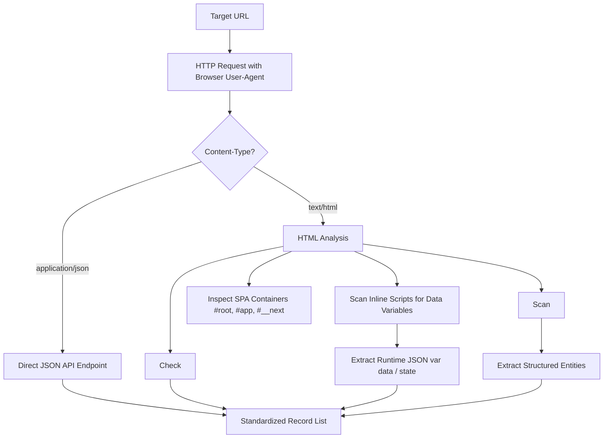

# System Architecture & Technical Flow

## 1. Overview
This project is an enterprise-grade, clean-code implementation of a Dynamic Web Scraper and PostgreSQL Management Engine, developed for the **NestorBird Python Assignment**.

It addresses the fundamental challenges of modern web scraping:
1. Identifying whether a target website is dynamic (client-side rendered via JavaScript/APIs).
2. Extracting structured data from diverse formats (dynamic inline JS variables, Next.js hydration, JSON-LD, tables, and standard DOM elements).
3. Storing multi-source, heterogeneous data into PostgreSQL using `psycopg2` via a hybrid relational-JSONB schema.
4. Exposing RESTful CRUD and database schema introspection APIs via FastAPI.
5. Providing a dedicated CLI utility for generating clean, formatted CSV exports.

---

## 2. Dynamic Website Identification Flow



### How to Identify Dynamic Websites Manually (DevTools):
1. **Disable JavaScript:** Open Chrome DevTools (`F12`), press `Ctrl+Shift+P`, type `Disable JavaScript`, and refresh the page.
   - If the main content disappears or displays placeholders/spinners, the page is dynamic.
2. **Inspect Network Tab:** Filter by `Fetch/XHR`. Dynamic sites asynchronously fetch JSON payloads from internal backend endpoints.
3. **Inspect Page Source:** View page source (`Ctrl+U`). In dynamic sites, the rendered DOM differs from the raw server HTML; data is often stored in `<script>` tags (e.g. `var data = [...]` or `<script id="__NEXT_DATA__">`).

---

## 3. Database Schema Design (PostgreSQL + psycopg2)

To satisfy the requirement that **CRUD operations work on data scraped from any website**, we use a hybrid relational + JSONB model:

```sql
CREATE TABLE IF NOT EXISTS scraped_records (
    id SERIAL PRIMARY KEY,
    source_url TEXT NOT NULL,
    entity_type VARCHAR(100) DEFAULT 'generic',
    title TEXT,
    content TEXT,
    raw_data JSONB NOT NULL DEFAULT '{}',
    created_at TIMESTAMP WITH TIME ZONE DEFAULT CURRENT_TIMESTAMP,
    updated_at TIMESTAMP WITH TIME ZONE DEFAULT CURRENT_TIMESTAMP
);

CREATE INDEX idx_scraped_records_url ON scraped_records(source_url);
CREATE INDEX idx_scraped_records_entity ON scraped_records(entity_type);
CREATE INDEX idx_scraped_records_raw_data ON scraped_records USING gin(raw_data);
```

### Why this design?
- **Universal compatibility:** Any website (quotes, products, articles, tables, JSON APIs) fits cleanly without breaking schema constraints.
- **Relational querying:** Filter, sort, and paginate quickly on `id`, `source_url`, `entity_type`, and `created_at`.
- **Deep querying:** PostgreSQL `JSONB` with a GIN index allows fast querying into nested attributes (e.g. `raw_data->'author'->>'name'`).

---

## 4. API Endpoints Summary

| Method | Endpoint | Description |
|---|---|---|
| `POST` | `/api/scrape` | Scrape any URL, identify dynamism, and store in PostgreSQL |
| `GET` | `/api/data` | Read records with URL, entity, search keyword, and pagination filters |
| `GET` | `/api/data/{id}` | Read single record by ID |
| `POST` | `/api/data` | Manually create a new record |
| `PUT` | `/api/data/{id}` | Update an existing record |
| `DELETE` | `/api/data/{id}` | Delete a record by ID |
| `GET` | `/api/schema/tables` | List all user tables in public schema |
| `GET` | `/api/schema/tables/{table_name}` | Get columns and data types for a table |
| `GET` | `/api/schema` | Get full schema overview |
| `GET` | `/` | Health check and API directory |
| `GET` | `/docs` | Interactive Swagger UI documentation |
